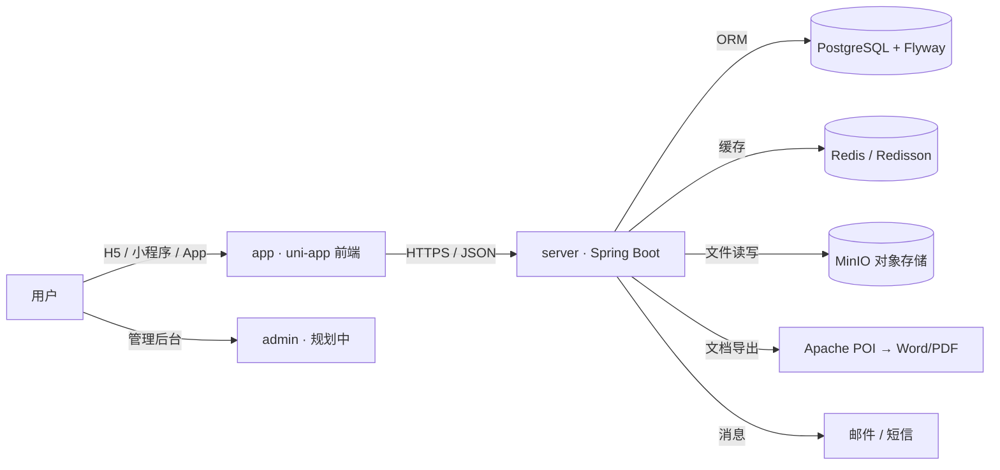

<div align="center">


# 伯乐 Bole

**千里马常有，而伯乐不常有。**

一个开源的个人职业档案与简历生成平台 —— 帮你把人生中的种种过往沉淀为结构化履历，再通过模板一键生成精美简历，让每一位「千里马」都能被「伯乐」看见。

[](LICENSE)
[](https://github.com/javaeer/bole/releases)
[](https://github.com/javaeer/bole/actions/workflows/ci.yml)
[](https://github.com/javaeer/bole)
[](https://github.com/javaeer/bole/commits/main)
[](https://deepwiki.com/javaeer/bole)

</div>

---

## 📖 简介 / Introduction

> 浏览各大平台突发奇想，为何自己的过往总被遗忘？
> 应该有一个地方，安放着种种过往 —— 或可见、或不可见，随时可拿来观望，亦或供人瞻仰，亦或给人笑场。何不以此为机，做个宽敞。

**伯乐（Bole）** 是一个 **开源的个人职业档案与简历生成平台**。它把教育经历、工作经历、项目经验、技能、自我评价等「人生过往」沉淀为结构化数据，再通过模板引擎一键生成精美简历文档（Word / PDF）；同时支持公司 / 院校关注、作品集展示与分享，让「千里马」被「伯乐」看见。

- 🌐 一份数据，多端呈现：H5、微信小程序、App、鸿蒙等
- 🧩 模块化履历：自由组合教育 / 工作 / 项目 / 技能 / 自评等模块
- 🎨 模板引擎：布局、字体、间距可配置，所见即所得
- 📄 文档导出：基于 Apache POI 生成可编辑的 Word / PDF
- 🔐 账号与权限：JWT 鉴权 + RBAC 角色权限

## ✨ 功能特性 / Features

| 模块 | 说明 |
| --- | --- |
| 🗂 结构化履历 | 简历主档 + 教育 / 工作 / 项目经历、技能、求职意向、自我评价 |
| 🧩 模板引擎 | 简历模板、组件、布局列与样式（字体、间距）解耦，灵活组合 |
| 📄 文档生成 | `DocumentTask` 驱动，基于 POI 导出 Word / PDF 简历 |
| 📦 对象存储 | 集成 MinIO，统一管理头像、附件、导出文件 |
| 👤 账号体系 | 注册登录、JWT 鉴权、`User` / `Role` / `UserRole` RBAC |
| 🏙 基础数据 | 城市、地区、公司、院校、数据字典等 |
| 💬 互动社区 | 公司 / 院校关注、公司评论、用户反馈 |
| 📨 消息中心 | 邮件、短信与消息模板（`Email` / `Sms` / `MessageTemplate`） |
| 🖥 多端前端 | uni-app 一套代码，覆盖 H5 / 微信小程序 / App / 鸿蒙等 |
| 📚 API 文档 | 集成 Knife4j（OpenAPI 3），接口自动成文档 |
| 🗄 数据库版本化 | Flyway 管理 SQL 迁移，环境一致可回滚 |

## 🛠 技术栈 / Tech Stack

| 层级 | 技术 |
| --- | --- |
| 前端 | [uni-app](https://uniapp.dcloud.net.cn/) · Vue 3 · TypeScript · Vite · Pinia · vue-i18n |
| 后端 | Java 17 · [Spring Boot 3.1](https://spring.io/projects/spring-boot) · [MyBatis-Plus](https://baomidou.com/) |
| 安全 | JWT（jjwt）· RBAC |
| 数据持久化 | PostgreSQL · [Flyway](https://flywaydb.org/)（数据库迁移） |
| 缓存 | Redis · [Redisson](https://redisson.org/) |
| 对象存储 | [MinIO](https://min.io/) |
| 文档导出 | [Apache POI](https://poi.apache.org/) |
| API 文档 | [Knife4j](https://doc.xiaominfo.com/)（OpenAPI 3） |
| 工具 | Lombok · MapStruct · springdoc-openapi |
| 部署 | Docker · Docker Compose |

## 🖼 界面预览 / Preview

<div align="center">
  
  
  
  <p><sub>示意图为占位预览，实际界面以发布版本为准。</sub></p>
</div>

## 📐 系统架构 / Architecture

整体采用**前后端分离 + 基础设施容器化**的架构，详见 [docs/ARCHITECTURE.md](docs/ARCHITECTURE.md)。



## 📁 目录结构 / Project Structure

```text
bole/
├── app/                 # 前端：uni-app + Vue 3 + TypeScript（H5 / 小程序 / App）
│   ├── src/             # 页面与业务逻辑
│   ├── .env.*           # 多环境配置（development / test / production）
│   ├── build.sh         # 构建脚本
│   └── deploy.sh        # 部署脚本
├── admin/               # 管理后台（规划中 / 占位）
├── server/              # 后端：Spring Boot 3 + MyBatis-Plus
│   ├── src/main/java/cn/net/yunlou/bole/
│   │   ├── controller/  # 接口层（Auth / Resumes / File / ...）
│   │   ├── service/     # 业务层
│   │   ├── model/       # 实体与 DTO（create / edit / query / view）
│   │   ├── handler/     # 组件 / 文档 / 消息 / 存储 等处理器
│   │   └── common/      # 公共注解、安全、工具
│   ├── pom.xml
│   └── mvnw             # Maven Wrapper
├── pg/                  # PostgreSQL 镜像与初始化脚本
├── redis/               # Redis 镜像与配置
├── minio/               # MinIO 镜像与初始化脚本
├── docker-compose.yaml  # 一键编排全部服务
├── LICENSE
├── CONTRIBUTING.md
├── CODE_OF_CONDUCT.md
├── SECURITY.md
└── README.md
```

## ⚡ 快速开始 / Quick Start

### 环境要求

- JDK 17+
- Node.js 18+ 与 [pnpm](https://pnpm.io/)
- Docker 与 Docker Compose（推荐一键启动）

### 方式一：Docker Compose 一键启动（推荐）

```bash
# 克隆仓库
git clone https://github.com/javaeer/bole.git
cd bole

# 启动全部依赖与前后端（PostgreSQL / Redis / MinIO / server / app）
docker compose up -d

# 查看服务状态
docker compose ps
```

启动后默认访问地址：

| 服务 | 地址 | 说明 |
| --- | --- | --- |
| 前端 H5 | http://localhost | uni-app 打包后的静态站点 |
| 后端 API | http://localhost:8080 | Spring Boot 服务 |
| API 文档 | http://localhost:8080/doc.html | Knife4j 接口文档 |
| MinIO 控制台 | http://localhost:9001 | 对象存储管理（账号见下） |

> 默认账号：`minioadmin` / `minioadmin123`；数据库：`bole_db` / `bole` / `bole_password`。生产环境请务必修改。

### 方式二：本地分模块启动

**后端（server）**

```bash
cd server
# 需先准备好 PostgreSQL / Redis / MinIO（可用 docker-compose 仅启动基础设施）
./mvnw clean package -DskipTests
java -jar target/bole-server-1.0.0.jar
```

**前端（app）**

```bash
cd app
pnpm install
pnpm run dev:h5        # H5 开发模式
# 其他平台：pnpm run dev:mp-weixin / pnpm run build:app ...
```

## ⚙️ 配置说明 / Configuration

后端通过环境变量注入（见 `docker-compose.yaml`），常用配置如下：

| 变量 | 说明 | 默认值 |
| --- | --- | --- |
| `SPRING_DATASOURCE_URL` | PostgreSQL JDBC 地址 | `jdbc:postgresql://bole-postgresql:5432/bole_db` |
| `SPRING_DATASOURCE_USERNAME` | 数据库用户名 | `bole` |
| `SPRING_DATASOURCE_PASSWORD` | 数据库密码 | `bole_password` |
| `SPRING_REDIS_HOST` / `SPRING_REDIS_PORT` | Redis 地址 | `bole-redis` / `6379` |
| `MINIO_ENDPOINT` | MinIO 服务地址 | `http://bole-minio:9000` |
| `MINIO_ACCESS_KEY` / `MINIO_SECRET_KEY` | MinIO 密钥 | `minioadmin` / `minioadmin123` |
| `API_BASE_URL` | 前端调用的后端地址 | `http://bole-server:8080` |

前端多环境配置位于 `app/.env.development` / `.env.test` / `.env.production`，按环境切换 `VITE_*` 前缀的后端地址等。

## 📚 API 文档

后端集成 [Knife4j](https://doc.xiaominfo.com/)，启动后访问：

```
http://localhost:8080/doc.html
```

支持 OpenAPI 3 描述，可在文档页直接调试接口。

## 🗺 路线图 / Roadmap

- [x] 结构化履历与模板引擎
- [x] 文档导出（Word / PDF）
- [x] 账号体系与 RBAC
- [ ] 管理后台 `admin` 落地
- [ ] 作品集公开展示与分享页
- [ ] 多语言（i18n）前端完善
- [ ] 简历 AI 润色与智能排版
- [ ] 移动端原生体验优化

欢迎在 [Issues](https://github.com/javaeer/bole/issues) 中提出你的想法。

## 🤝 贡献 / Contributing

非常欢迎一起把伯乐做得更「宽敞」！提交 Issue、PR 或参与讨论都很有价值。

- 提交 Bug 或功能建议：请使用 [Issue 模板](https://github.com/javaeer/bole/issues/new/choose)
- 提交代码：请先阅读 [CONTRIBUTING.md](CONTRIBUTING.md)，遵循分支模型与提交规范（Conventional Commits）
- 行为准则：请遵守 [CODE_OF_CONDUCT.md](CODE_OF_CONDUCT.md)

## 🔒 安全 / Security

如果你发现安全漏洞，请**不要**通过公开 Issue 反馈，而应按照 [SECURITY.md](SECURITY.md) 中的方式私下联系维护者。

## 📄 许可证 / License

本项目基于 [MIT License](LICENSE) 开源。

## 🙏 致谢 / Acknowledgements

- [uni-app](https://uniapp.dcloud.net.cn/) · [Vue](https://vuejs.org/) · [Spring Boot](https://spring.io/projects/spring-boot)
- [MyBatis-Plus](https://baomidou.com/) · [Knife4j](https://doc.xiaominfo.com/) · [MinIO](https://min.io/)
- 灵感来自「千里马常有，而伯乐不常有」——愿每一份过往都被妥善安放。

---

<p align="center">Made with ❤️ by the Bole community</p>
