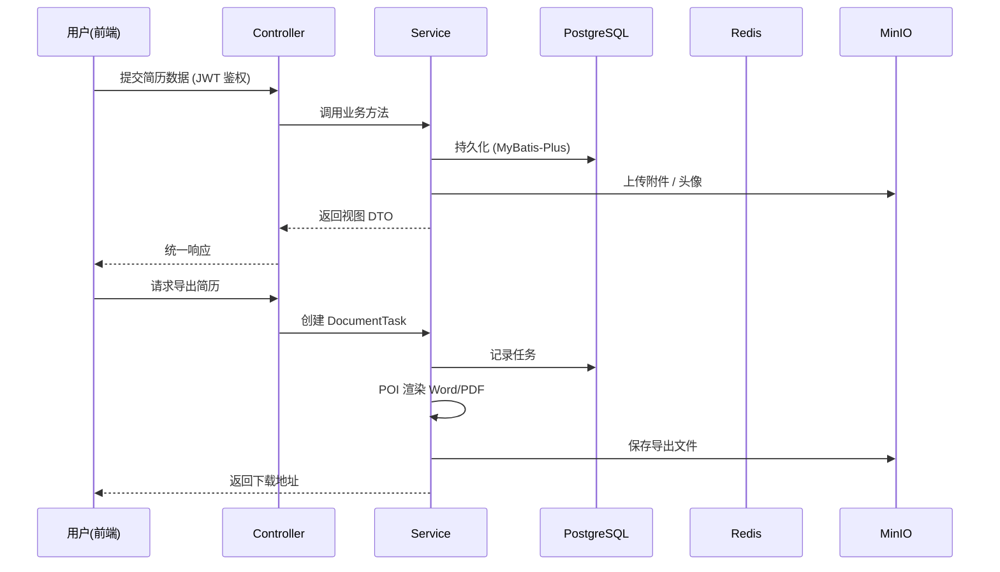
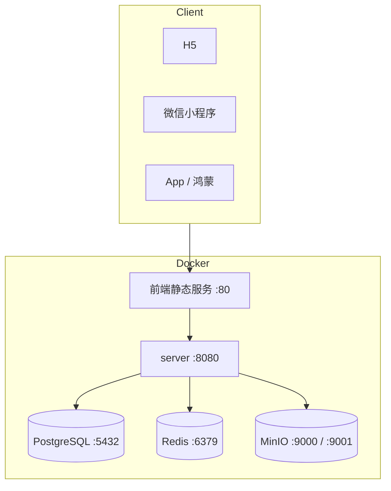

# 系统架构 / Architecture

本文档说明伯乐（Bole）的整体架构、模块划分与技术选型，配合根目录 [README.md](../README.md) 阅读。

## 1. 设计概览

伯乐采用**前后端分离 + 基础设施容器化**的架构：

- **前端（app）**：基于 uni-app + Vue 3 + TypeScript，一套代码编译到 H5、微信小程序、App、鸿蒙等多端。
- **后端（server）**：基于 Spring Boot 3 的单体应用，提供 RESTful API，承载全部业务逻辑。
- **基础设施**：PostgreSQL（持久化）、Redis（缓存 / 分布式锁）、MinIO（对象存储）均以容器方式提供，通过 `docker-compose.yaml` 一键编排。

## 2. 分层结构（后端）

```text
controller/   接口层：接收请求、参数校验、统一响应
service/      业务层：核心业务逻辑
  └─ impl/    业务实现
mapper/       MyBatis-Plus 数据访问层
model/
  ├─ entity/  数据库实体
  ├─ create/  创建请求 DTO
  ├─ edit/    更新请求 DTO
  ├─ query/   查询请求 DTO
  └─ view/    响应视图 DTO
handler/
  ├─ component/  简历组件处理
  ├─ document/   文档生成（Word / PDF）
  ├─ message/    邮件 / 短信
  ├─ storage/    MinIO 文件存储
  └─ resumes/    简历业务处理
common/
  ├─ annotation/ 自定义注解
  ├─ security/   JWT / 安全
  ├─ constant/   常量
  ├─ handler/    全局异常等
  └─ utils/      工具类
config/        Spring 配置（安全、Swagger、Redis 等）
```

DTO 按 `create / edit / query / view` 拆分，配合 MapStruct 完成实体与视图对象的映射，保证入参与出参职责清晰。

## 3. 核心数据流



## 4. 关键技术决策

| 决策点 | 选型 | 理由 |
| --- | --- | --- |
| Web 框架 | Spring Boot 3.1 | 生态成熟、自动配置、长期支持 |
| ORM | MyBatis-Plus | 兼顾灵活 SQL 与 CRUD 效率，含代码生成 |
| 数据库迁移 | Flyway | SQL 版本可控、环境一致、可回滚 |
| 缓存 / 锁 | Redisson | 分布式场景下的可靠 Redis 客户端 |
| 对象存储 | MinIO | 兼容 S3 协议，可私有化部署 |
| 文档导出 | Apache POI | 生成可编辑的 Word，而非单纯图片 |
| API 文档 | Knife4j | 基于 OpenAPI 3，界面友好、可调试 |
| 多端前端 | uni-app | 一套代码多端发布，降低维护成本 |

## 5. 部署拓扑



生产环境建议在前端静态服务与 `server` 之前增加反向代理（Nginx 等）并统一启用 HTTPS；敏感配置（数据库密码、MinIO 密钥）通过环境变量注入，避免硬编码。
